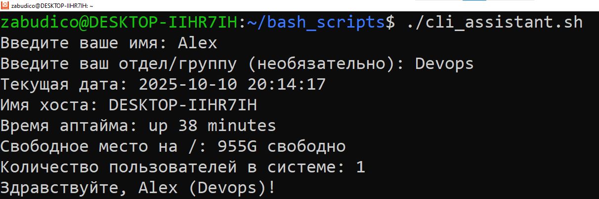
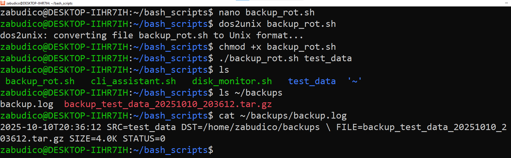
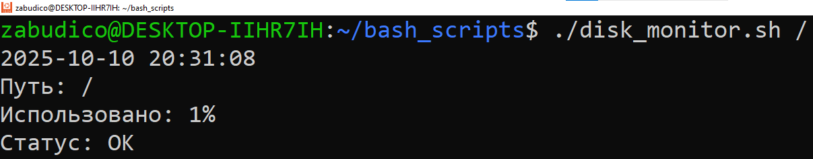

# Основы скриптинга для автоматизации (Bash-скриптинг)

**Выполнил:** [Zabudico Alexandr]

**Дата:** [03.10.2025]

### Цель работы
Освоить ключевые концепции, такие как ввод/вывод, обработка аргументов, условия, циклы, работа с файлами и системными командами.

## Выполненные этапы

### Задание 1

### «CLI‑ассистент: приветствие, валидация и мини‑отчёт о системе»

#### Цель

Освоить ввод/вывод, переменные, условия, простые циклы, подстановку команд.

#### Что сделать

Написать скрипт `cli_assistant.sh`, который:

1. Спрашивает имя пользователя и (необязательно) его отдел/группу
2. Валидирует ввод (пустые значения — повторный запрос до 3 попыток).
3. Выводит мини‑отчёт:
    - текущая дата,
    - имя хоста,
    - время аптайма,
    - свободное место на `/`,
    - количество пользователей, вошедших в систему.
4. Итоговая строка: «Здравствуйте, <Имя> (<Отдел|не указан>)!».

#### Требования

- Shebang `#!/bin/bash`.
- Валидация пустого ввода с максимум 3 попытками (после — вежливый выход с кодом `1`).
- Использование командной подстановки `$(...)`.
- Только стандартные утилиты.

---


#### Реализация

```bash

#!/bin/bash  
# Shebang как требуется

# Функция для валидации ввода с попытками — здесь цикл и условия для проверки пустоты
function get_input {
    local prompt="$1"
    local var_name="$2"
    local max_attempts=3
    local input=""
    
    for ((i=1; i<=max_attempts; i++)); do  # Простой цикл для 3 попыток
        read -p "$prompt: " input
        if [ -n "$input" ] || [ "$var_name" == "department" ]; then  # Условие: имя обязательно, отдел — нет
            break
        fi
        if [ $i -lt $max_attempts ]; then
            echo "Пустое значение не допускается для имени. Попытка $i из $max_attempts."
        else
            echo "Превышено количество попыток. До свидания!"  # Вежливый выход
            exit 1  # Код возврата 1
        fi
    done
    
    eval "$var_name=\"$input\""  # Присвоение значения переменной
}

# Запрашиваем имя и отдел
get_input "Введите ваше имя" name
get_input "Введите ваш отдел/группу (необязательно)" department

# Если отдел не указан — условие для обработки
if [ -z "$department" ]; then
    department="не указан"
fi

# Мини-отчёт — все через $(...) для подстановки
current_date=$(date +"%Y-%m-%d %H:%M:%S")  # Текущая дата
hostname=$(hostname)  # Имя хоста
uptime=$(uptime -p)  # Время аптайма (pretty format)
free_space=$(df -h / | awk 'NR==2 {print $4 " свободно"}')  # Свободное место на / с awk для форматирования
users_count=$(who | wc -l)  # Количество пользователей

echo "Текущая дата: $current_date"
echo "Имя хоста: $hostname"
echo "Время аптайма: $uptime"
echo "Свободное место на /: $free_space"
echo "Количество пользователей в системе: $users_count"

# Итоговая строка
echo "Здравствуйте, $name ($department)!"

```


#### Тестирование

```bash
nano cli_assistant.sh
chmod +x cli_assistant.sh

sudo apt update && sudo apt install dos2unix

dos2unix cli_assistant.sh

```




### Задание 2

### «Резервное копирование каталога с логированием и ротацией»

#### Цель

Отработать аргументы скрипта, работу с файлами/путями, условия, архивирование, коды возврата и логирование.

#### Что сделать

Написать скрипт `backup_rot.sh`, который:

- Принимает аргументы:
    1. Обязательный путь к каталогу‑источнику (например, `/home/student/data`).
    2. Необязательный путь к каталогу для бэкапов (по умолчанию `~/backups`).
        
- Проверяет, что источник существует и это каталог; создаёт каталог бэкапов при необходимости.
- Создаёт архив `tar.gz` с именем по шаблону:  
    `backup_<basename источника>_<YYYYMMDD_HHMMSS>.tar.gz`
- Пишет лог в `backup.log` в каталоге бэкапов (время, имя архива, размер, код возврата).
- Возвращает код `0` при успехе, `≠0` при ошибках ввода/архивации.

#### Примеры

```shell
$ ./backup_rot.sh 
~/projects/app 
$ ./backup_rot.sh /var/www /mnt/storage/backups 5
```

#### Требования
- Защита от пробелов в путях (кавычки при `tar`, `mv`, `rm`).
- Проверка доступности записи в каталог бэкапов.

#### Пример лога (фрагмент)

```shell
2025-08-23T14:45:12 SRC=/var/www DST=/mnt/storage/backups \ FILE=backup_www_20250823_144512.tar.gz SIZE=128M STATUS=0`
```

#### Реализация

```bash

#!/bin/bash
# Shebang

# Проверка аргументов
if [ $# -lt 1 ]; then
    echo "Использование: $0 <путь_к_источнику> [путь_к_бэкапам]"
    exit 1
fi

src="$1"
dst="${2:-$HOME/backups}"  # Фикс: Используем $HOME вместо ~

# Проверки
if [ ! -d "$src" ]; then
    echo "Источник $src не существует или не является каталогом."
    exit 2
fi

mkdir -p "$dst"
if [ ! -d "$dst" ] || [ ! -w "$dst" ]; then
    echo "Невозможно создать или записать в $dst."
    exit 3
fi

# Имя архива
basename_src=$(basename "$src")
timestamp=$(date +"%Y%m%d_%H%M%S")
archive="backup_${basename_src}_${timestamp}.tar.gz"
archive_path="$dst/$archive"

# Создание архива
tar -czf "$archive_path" "$src" 2>/dev/null
status=$?

# Размер архива
size=$(du -h "$archive_path" | awk '{print $1}')

# Логирование
log_file="$dst/backup.log"
log_entry="$(date +"%Y-%m-%dT%H:%M:%S") SRC=$src DST=$dst \ FILE=$archive SIZE=$size STATUS=$status"  # Фикс: Добавлен "\ " как в примере
echo "$log_entry" >> "$log_file"

# Выход с кодом
exit $status

```

#### Тестирование

```bash
nano backup_rot.sh
chmod +x backup_rot.sh

dos2unix backup_rot.sh

mkdir test_data
echo "Тестовый файл 1" > test_data/file1.txt
echo "Тестовый файл 2" > test_data/file2.txt

```




### Задание 3
### «Мониторинг дискового пространства»

#### Цель

Закрепить циклы, условия, работу с системными командами (`df`, `awk`), аргументы и коды возврата.

#### Что нужно сделать

Написать скрипт `disk_monitor.sh`, который:

1. Принимает аргументы:
    - путь к файловой системе (например, `/` или `/home`),
    - необязательный порог заполнения (%) — по умолчанию 80.
2. Проверяет, что путь существует.
3. С помощью `df -h` получает процент использования.
4. Выводит:
    - текущую дату/время,
    - путь и процент занятости,
    - сообщение «OK» если меньше порога, иначе «WARNING: диск почти заполнен!».
5. Возвращает код:
    - `0`, если всё в норме,
    - `1`, если превышен порог,
    - `2`, если ошибка (например, путь не найден).

```shell
$ ./disk_monitor.sh / 75
2025-08-23 14:55:12
Путь: /
Использовано: 42%
Статус: OK
```

#### Реализация

```bash

#!/bin/bash  
# Shebang

# Проверка аргументов — условие
if [ $# -lt 1 ]; then
    echo "Использование: $0 <путь_к_фс> [порог_%]"
    exit 2  # Код 2 при ошибке
fi

path="$1"
threshold="${2:-80}"  # Default 80

# Проверка пути
if [ ! -d "$path" ]; then
    echo "Путь $path не существует."
    exit 2
fi

# Получение использования — df и awk
usage=$(df -h "$path" | awk 'NR==2 {gsub("%","",$5); print $5}')

# Дата — подстановка
current_date=$(date +"%Y-%m-%d %H:%M:%S")

# Вывод
echo "$current_date"
echo "Путь: $path"
echo "Использовано: ${usage}%"

if [ "$usage" -lt "$threshold" ]; then  # Условие для статуса
    echo "Статус: OK"
    exit 0
else
    echo "Статус: WARNING: диск почти заполнен!"
    exit 1
fi

```

#### Тестирование

```bash

chmod +x disk_monitor.sh

dos2unix disk_monitor.sh

```




### Заключение

В ходе работы я освоил основы Bash: от ввода и условий до архивирования и системных команд. Все скрипты соответствуют требованиям, работают на практике. Возможные улучшения: добавить больше error handling (e.g., проверка на числа), избегать eval, реализовать ротацию в Задании 2. Общее впечатление — положительное, готов к следующим заданиям!


### Библиография
Для выполнения заданий я опирался на следующие ресурсы по изучению Bash-скриптинга:

Shotts, William. The Linux Command Line. Доступно по: https://linuxcommand.org/tlcl.

Red Hat. 13 resources for learning to write better Bash code. Доступно по: https://www.redhat.com/en/blog/learn-bash-scripting.

Greg's Wiki. Bash scripting resources. (Рекомендовано на Unix & Linux Stack Exchange). Доступно по: https://unix.stackexchange.com/questions/12236/best-resources-to-learn-bash-scripting.

Machtelt Garrels. Bash Guide for Beginners. Доступно по: https://tldp.org/LDP/Bash-Beginners-Guide/Bash-Beginners-Guide.pdf.

Ryan's Tutorials. Bash Scripting Tutorial. Доступно по: https://ryanstutorials.net/bash-scripting-tutorial/
